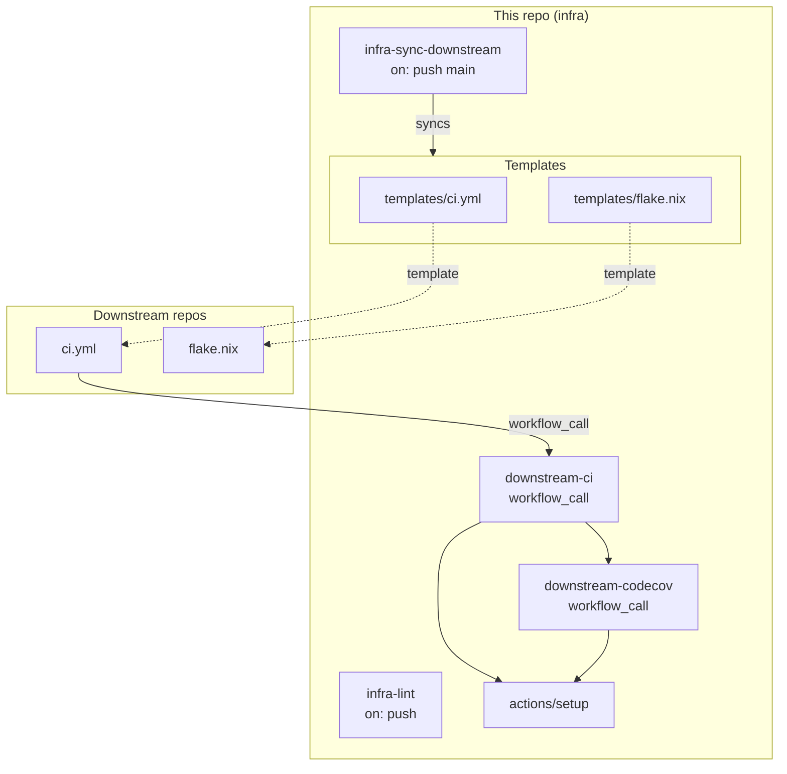

# CI Architecture

This repo is the single source of truth for CI configuration across all cubething-qproj repositories. When changes are pushed to `main`, `infra-sync-downstream.yml` copies shared files (workflows, scripts, config) to each downstream repo and opens a PR. Downstream repos have a thin `ci.yml` stub (from `templates/ci.yml`) that calls back to `downstream-ci.yml` here via `workflow_call`. If CI passes on a sync PR, it auto-merges; if it fails, an issue is created.

All build workflows share a composite action (`actions/setup`) that handles Nix installation (DeterminateSystems), nix store caching (magic-nix-cache), Cargo caching, sccache, and apt dependencies. The dev shell environment is exported once via `nicknovitski/nix-develop` so subsequent steps run without `nix develop --command` wrappers. Workflow files are prefixed by scope: `downstream-*` for reusable workflows called by downstream repos, `infra-*` for workflows that run on this repo.

