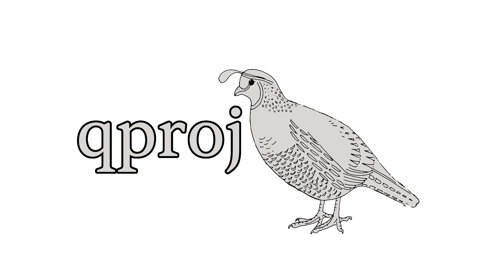

<div align="center">
    </img>
</div>

Shared infrastructure for the _qproj_ family of crates — scripts, Cargo
workspace config, Nix flake, CI, and dev tooling.

## Crates

| Crate | Description |
|-------|-------------|
| [quell](https://github.com/cubething-qproj/quell) | Game binary + assets |
| [q_screens](https://github.com/cubething-qproj/q_screens) | Screens extension for Bevy |
| [q_term](https://github.com/cubething-qproj/q_term) | Bevy terminal emulator widget |
| [q_test_harness](https://github.com/cubething-qproj/q_test_harness) | Simple test harness for Bevy applications |

## Setup

```bash
./setup.sh
```

This clones all sibling repos, sets up bare-repo + worktree layouts, and
creates root-level symlinks for `Cargo.toml`, `Cargo.lock`, and `.envrc`.

## Compatibility

| branch/tag | bevy |
| ---------- | ---- |
| main       | 0.18 |

## License

Licensed under either of [Apache License, Version 2.0](LICENSE-APACHE.txt) or
[MIT License](LICENSE-MIT.txt) at your option.
