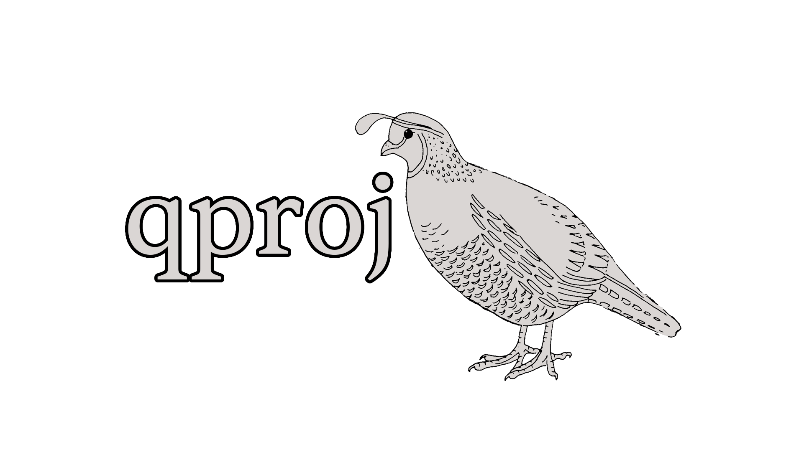

    </img>

Shared infrastructure for the _qproj_ family of crates — scripts, project
template, Nix flake, CI, and dev tooling.

## Crates

| Crate | Description |
|-------|-------------|
| [quell](https://github.com/cubething-qproj/quell) | Game binary + assets |
| [q_screens](https://github.com/cubething-qproj/q_screens) | Screens extension for Bevy |
| [q_term](https://github.com/cubething-qproj/q_term) | Bevy terminal emulator widget |
| [q_test_harness](https://github.com/cubething-qproj/q_test_harness) | Simple test harness for Bevy applications |

## Requirements

Local development runs on the host toolchain; nix is only needed to
reproduce CI (`nix develop .#ci`).

- [rustup](https://rustup.rs/) — picks up the pinned nightly from `rust-toolchain.toml`
- [direnv](https://direnv.net/) — loads `.envrc`
- [just](https://github.com/casey/just)
- [uv](https://docs.astral.sh/uv/)
- [gh](https://cli.github.com/)

Host packages (Arch names):

- libraries and build tools:
  `alsa-lib systemd-libs wayland libxkbcommon vulkan-icd-loader pkgconf clang mold`
- tools: `sccache python cargo-nextest cargo-llvm-cov cargo-deny actionlint patchelf rsync`

Per-workflow extras: `act` plus Docker for `just ci`; `dx` (dioxus-cli) for
`just dev`; cmake and a C++ compiler to build the Jackdaw editor.

Install the shared CLI against the host Python with `just sync-scripts`.

## Compatibility

| branch/tag | bevy |
| ---------- | ---- |
| main       | [`.bevy-version`](.bevy-version) |

## About the bird
> _The California quail is a highly sociable bird that often gathers in small flocks known as "coveys". One of their daily communal activities is a dust bath. A group of quail will select an area where the ground has been newly turned or is soft, and using their underbellies, will burrow downward into the soil some one to two inches. They then wriggle about in the indentations they have created, flapping their wings and ruffling their feathers, causing dust to rise in the air. They seem to prefer sunny places in which to create these dust baths. An ornithologist is able to detect the presence of quail in an area by spotting the circular indentations left behind in the soft dirt, some 7–15 cm (2.8–5.9 in) in diameter._ ([wikipedia](https://en.wikipedia.org/wiki/California_quail))

## License

Licensed under either of [Apache License, Version 2.0](LICENSE-APACHE.txt) or
[MIT License](LICENSE-MIT.txt) at your option.
