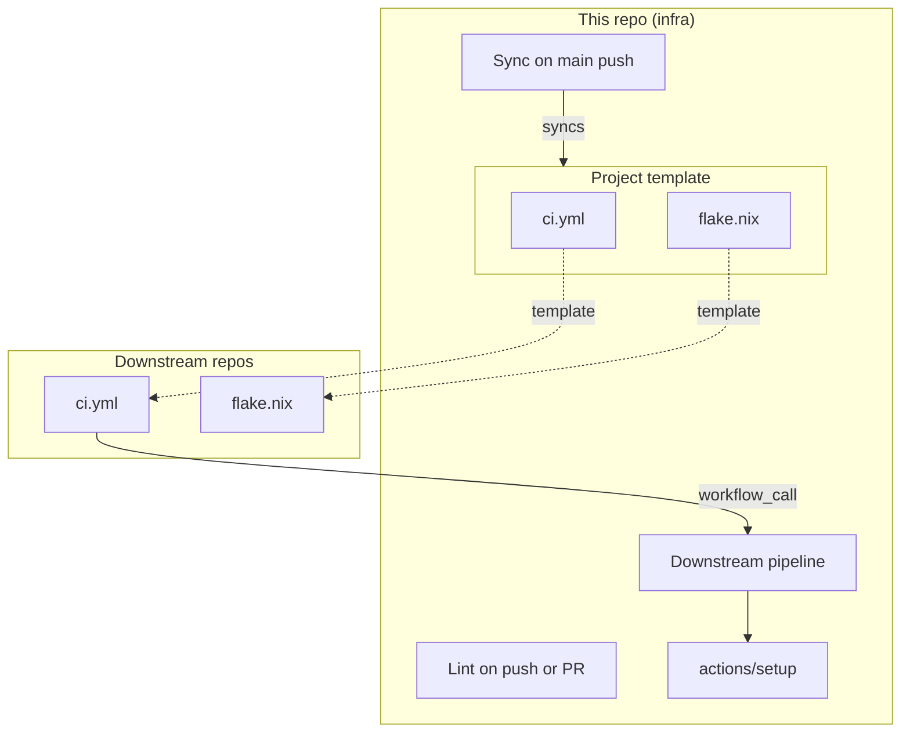

# CI Architecture

This repo is the source of truth for the files in `scripts/src/qproj_scripts/assets/project-template/`. `qproj-scripts init` copies the whole template when creating a repo. When changes reach infra's `main`, `infra-sync-downstream.yml` copies shared files from that template to each registered downstream and opens a PR. It skips `Cargo.toml`, `README.md`, `src/`, `.gitignore`, `.zed/settings.json`, and `justfile`: those belong to each crate after initialization. The sync replaces `{{bevy_version}}` using `.bevy-version`. The template's thin `.github/workflows/ci.yml` calls `downstream-pipeline.yml` here via `workflow_call`. Per-repo build/check/test arguments belong in GitHub Actions repository variables `QPROJ_BUILD_ARGS_JSON`, `QPROJ_CHECK_ARGS_JSON`, and `QPROJ_TEST_ARGS_JSON` (JSON arrays of strings), not edits to the synced workflow. Set `QPROJ_COVERAGE_ALL_FEATURES` to `true` in a repository to opt its coverage job into all features; unset/false retains default coverage. Passing sync PRs auto-merge; failures create an issue.

Build workflows use a composite action (`.github/actions/setup`) for Nix, Cargo caching, sccache, and apt dependencies. The dev shell is exported via `nicknovitski/nix-develop` so subsequent steps run without `nix develop --command` wrappers. Workflow files are prefixed by scope: `downstream-*` for reusable workflows and `infra-*` for workflows running on this repo.

